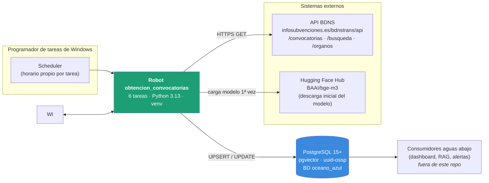
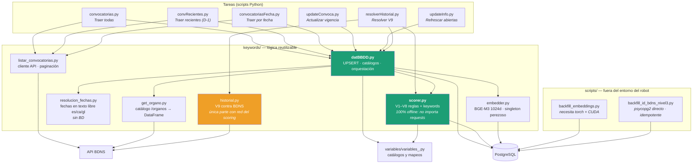
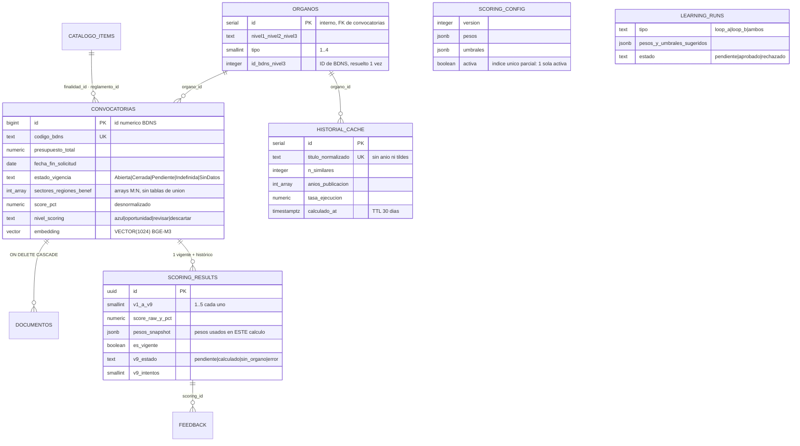
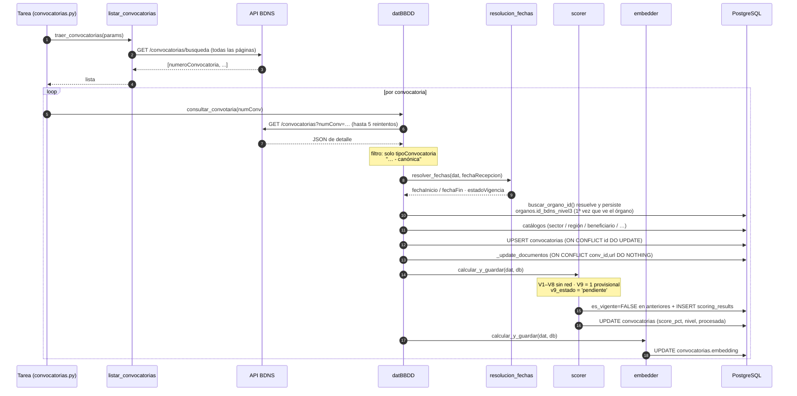
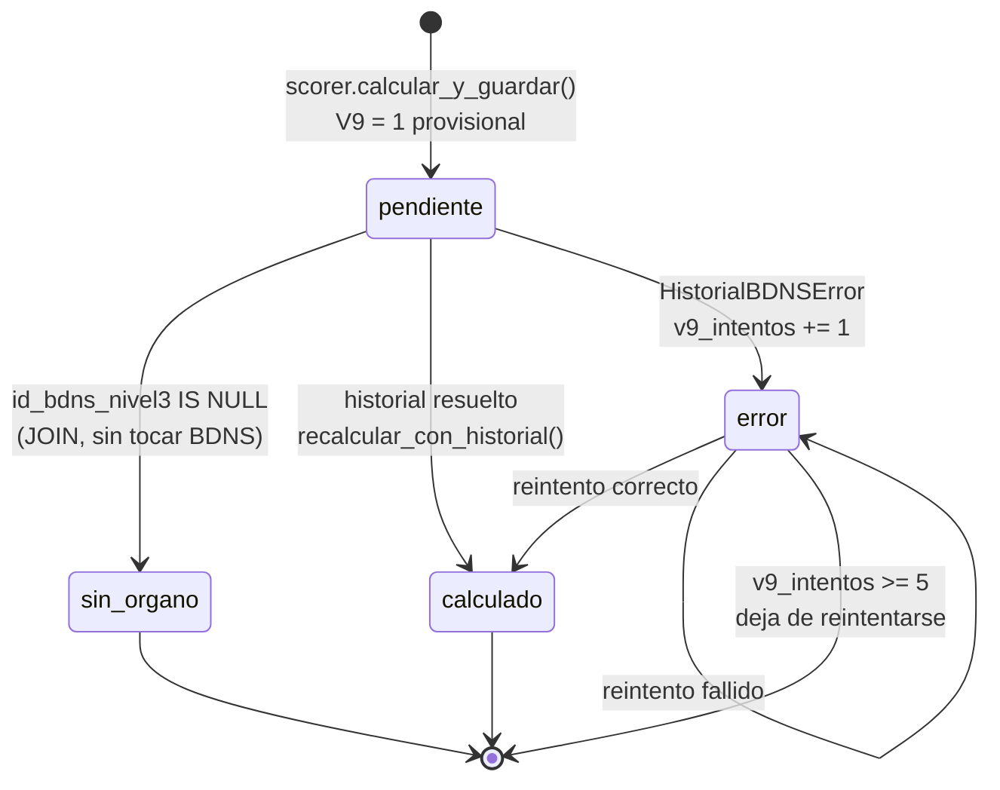
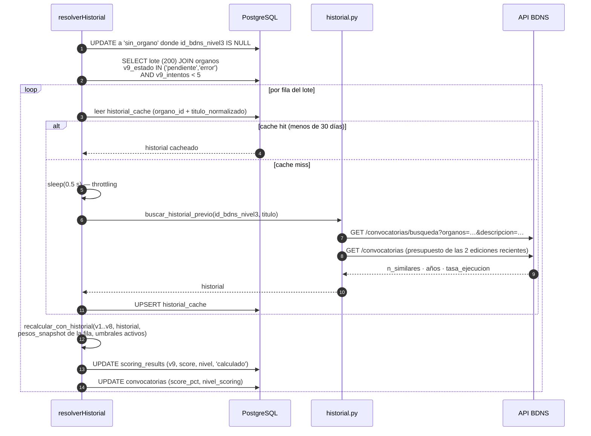

# Arquitectura — Océano Azul / Robot de convocatorias BDNS

> Documento de arquitectura del repositorio `obtencion_convocatorias`.
> Refleja el código en `main` a fecha 2026-09-22 (commit `63b12f6`).

---

## 1. Propósito y alcance

Robot de extracción diaria de la **BDNS** (Base de Datos Nacional de
Subvenciones) que mantiene un catálogo local de convocatorias públicas
españolas, puntuado y vectorizado.

**Alcance de este repositorio — nivel convocatoria:**

| Incluido | Excluido (a propósito) |
|---|---|
| Ingesta desde la API BDNS | Troceado de PDF / `documento_chunks` |
| UPSERT en PostgreSQL | Recuperación híbrida y reranking |
| Scoring V1–V9 por reglas (offline) | Generación con LLM sobre los resultados |
| Embedding BGE-M3 de la convocatoria | Cualquier dependencia de PDF u OCR |
| Resolución diferida del historial V9 | API HTTP / frontend |

Lo excluido pertenece a otro proyecto. **La restricción arquitectónica
principal es que este robot siga siendo ligero y rápido**: sin GPU, sin colas,
sin microservicios, y con la ruta caliente de ingesta libre de latencia de red
ajena a la propia descarga.

---

## 2. Vista de contexto



**Credenciales:** variables de entorno (`DB_HOST`, `DB_NAME`, `DB_USER`,
`DB_PASSWORD`, `DB_PORT`), cargadas desde `.env` (ignorado por git; plantilla
en `.env.example`). Nunca en el código ni en git.

---

## 3. Vista de componentes



### Responsabilidades

| Módulo | Responsabilidad | Invariante que sostiene |
|---|---|---|
| `listar_convocatorias.py` | Descarga la lista de `numeroConvocatoria` recorriendo todas las páginas de `/convocatorias/busqueda` (regiones 1–87). | Único punto que pagina la búsqueda. |
| `datBBDD.py` | Punto central. `databaseInsert()` hace el UPSERT y **después** llama a `scorer` y a `embedder`, en ese orden. | El scoring necesita la fila ya insertada; el embedding actualiza esa misma fila. **No romper ese orden.** |
| `get_organo.py` | Construye el catálogo completo de órganos BDNS (4 llamadas: `C`, `A`, `L`, `O`) como DataFrame. | Se cachea en `datBBDD._df_organos`: 4 llamadas por corrida, no por convocatoria. |
| `resolucion_fechas.py` | Parseo de `textInicio` / `textFin` (es/ca/gl) y cálculo de `estadoVigencia`. Sin dependencias de BD. | Testeable en aislado contra casos reales de la API. |
| `scorer.py` | Motor de reglas V1–V8 y clasificación. | **No importa `requests`.** Determinista y offline. |
| `historial.py` | V9: busca ediciones previas del mismo programa en BDNS. | Única parte del scoring con red; solo la llama `resolverHistorial.py`. |
| `embedder.py` | Embedding BGE-M3 normalizado de `descripcion` + bases reguladoras. | Singleton perezoso: el modelo se carga una vez por proceso, nunca por fila. |

---

## 4. Modelo de datos



### Decisiones de esquema relevantes

- **Arrays `INTEGER[]` con índices GIN** en lugar de cinco tablas de unión para
  sectores, regiones, beneficiarios, instrumentos y objetivos.
- **`score_pct` y `nivel_scoring` desnormalizados** en `convocatorias` para que
  el listado del dashboard no haga JOIN (`idx_conv_dashboard`: index-only scan
  parcial sobre `procesada = TRUE`).
- **Versionado del scoring:** cada recálculo marca la fila anterior
  `es_vigente = FALSE` e inserta una nueva. `pesos_snapshot` guarda los pesos
  aplicados, no una referencia a la config, para que un cambio de configuración
  no reinterprete cálculos pasados.
- **FTS en español** (`to_tsvector('spanish', descripcion)`) e **índice HNSW**
  con `vector_cosine_ops`, que casa con `normalize_embeddings=True`: con
  vectores normalizados el coseno equivale al producto punto.
- `scoring_config`, `feedback` y `learning_runs` existen en el esquema, pero
  **este repositorio solo lee `scoring_config`** (`cargar_config_activa()`).
  Las escrituras son competencia del proyecto de aprendizaje supervisado.

**Convención de migraciones:** `migrations/NNN_descripcion.sql`, numeradas, con
cabecera de comentario, `BEGIN;`…`COMMIT;` y un bloque `DO $$` de verificación.
`schema_init.sql` refleja el estado **final** del esquema (ya incluye 003, 006,
007 y 008); al añadir una migración hay que actualizarlo también.

---

## 5. Flujo de ingesta (ruta caliente)



**Tolerancia a fallos:** tanto `scorer.calcular_y_guardar()` como
`embedder.calcular_y_guardar()` capturan cualquier excepción interna y registran
el error sin interrumpir la ingesta. Una convocatoria sin score o sin embedding
se persiste igualmente y se recupera después (resolver o backfill).

---

## 6. Motor de scoring

Nueve criterios de 1 a 5, cada uno con su peso. `score_pct` es el porcentaje
sobre el máximo posible; el nivel sale de los umbrales.

| Criterio | Qué mide | Peso | Fuente |
|---|---|---|---|
| V1 `tramitacion_estandarizada` | Cuántos expedientes siguen el mismo flujo | 1.0 | keywords + `tipoConvocatoria` + instrumento |
| V2 `volumen` | Beneficiarios potenciales | 1.2 | tipo de beneficiario + alcance geográfico |
| V3 `cuantia` | Presupuesto total | 1.0 | campo estructurado |
| V4 `intermediarios` | Fortaleza del canal intermediario | **1.4** | keywords + tipo de beneficiario |
| V5 `presupuesto_recurrente` | Longevidad del programa | 1.1 | keywords de fondos + presupuesto |
| V6 `cultura_gestion` | Cultura de gestión de subvenciones del sector | 1.1 | tipo de beneficiario + keywords |
| V7 `req_tecnicos` | Requisitos técnicos y certificaciones | 1.3 | keywords |
| V8 `plazo_cobro` | Plazo de cobro estimado | **1.4** | instrumento BDNS + keywords |
| V9 `historial` | Recurrencia histórica del programa | 1.3 | **API BDNS (diferido)** |

`MAXIMO_POSIBLE = Σ(5 × peso) = 54.0`

```
score_raw = Σ(criterio_k × peso_k)
score_pct = score_raw / Σ(5 × peso_k) × 100
```

| Nivel | Umbral | Color |
|---|---|---|
| 🟢 `azul` | ≥ 80 % | `#1D9E75` |
| 🔵 `oportunidad` | 65–80 % | `#378ADD` |
| 🟡 `revisar` | 50–65 % | `#EF9F27` |
| 🔴 `descartar` | < 50 % | `#E24B4A` |

Los pesos y umbrales se leen de `scoring_config WHERE activa = TRUE`; si no hay
fila activa, `scorer` cae a `PESOS_DEFAULT` / `UMBRALES_DEFAULT`.

**Estrategia por capas.** Cada criterio resuelve en cascada: keywords de alta
señal primero, luego campos estructurados de BDNS (más fiables que el texto
libre), luego el instrumento como proxy y, por último, un default conservador.
Las listas de keywords están validadas contra 23.834 registros reales de BDNS.

---

## 7. V9 desacoplado de la ingesta

Es la decisión arquitectónica más importante del repositorio.

**Problema.** `buscar_historial_previo()` hace 1–3 llamadas HTTP a BDNS por
convocatoria. Vivía dentro de `scorer.calcular_y_guardar()`, en la ruta caliente
de `databaseInsert()`. Con `pageSize=10000` en «Traer todas las convocatorias»
eso multiplicaba el tiempo de ingesta y arriesgaba que BDNS bloqueara la IP.

**Solución.** La ingesta guarda V9 provisional (=1, conservador) y marca la fila
como pendiente. Un proceso aparte, con su propio horario, por lotes y con
throttling, resuelve el historial real y **completa la misma fila**: no crea una
versión nueva.

### Dos IDs de órgano, no confundir

| Campo | Qué es | Uso |
|---|---|---|
| `organos.id` | `SERIAL` interno propio | FK de `convocatorias.organo_id` |
| `organos.id_bdns_nivel3` | ID que BDNS usa para ese organismo en su propio catálogo | El único que entiende `?organos=X` en `/convocatorias/busqueda`, que es lo que necesita V9 |

No hay relación aritmética entre ambos. `id_bdns_nivel3` se resuelve **por
texto** (comparando `nivel3` contra el catálogo cacheado `df_organos`) **una
sola vez por órgano, dentro de `datBBDD.buscar_organo_id()`**, y se persiste.

### Máquina de estados de `v9_estado`



### Flujo de `resolverHistorial.py`



`recalcular_con_historial()` reutiliza el `pesos_snapshot` **de esa fila**, no la
config activa actual, que pudo cambiar mientras la convocatoria esperaba en la
cola. Los umbrales sí son los activos: no hay `umbrales_snapshot` en el esquema.

**Doble cacheado que hace esto viable:**

1. `organos.id_bdns_nivel3` — resolución por texto, una vez por órgano,
   persistida en columna.
2. `historial_cache` — resultado de BDNS por `organo_id` + título normalizado
   (sin año, sin tildes, sin puntuación), TTL 30 días. Las ediciones sucesivas
   de un mismo programa comparten entrada.

> ⚠️ **Trampa a no repetir.** Si se añade otro sitio que llame a
> `historial.buscar_historial_previo()` o a `datBBDD.get_id_organo_bdns()`
> directamente desde la ingesta o desde el resolver —en vez de leer
> `organos.id_bdns_nivel3` ya persistido— se reintroduce el cuello de botella y
> la fragilidad de matching que todo esto resolvió. Las diferencias de
> mayúsculas, tildes y espacios entre el endpoint de convocatorias y el de
> organismos de BDNS pueden hacer fallar el match **en silencio**.

---

## 8. Capa semántica (embeddings)

- Modelo **BGE-M3**, 1024 dimensiones, `normalize_embeddings=True`.
- Texto embebido: `descripcion` + `descripcionBasesReguladoras`, unidos por
  salto de línea (`embedder._texto_para_embedder()`).
- Índice HNSW con `vector_cosine_ops` (`m=16`, `ef_construction=64`).

**Dos caminos, un mismo texto:**

| Camino | Cuándo | Entorno |
|---|---|---|
| `keywords/embedder.py` | Por convocatoria, en la ingesta | Dentro del robot · torch CPU |
| `scripts/backfill_embeddings.py` | Backfill masivo, reanudable (`WHERE embedding IS NULL`) | **Fuera** del robot · torch con CUDA |

> ⚠️ Ambos deben construir **el mismo texto**. Si cambia uno y no el otro, la
> tabla acaba con embeddings de dos criterios distintos mezclados y la búsqueda
> semántica degrada sin dar ningún error.

> Las versiones de ML (torch, transformers, sentence-transformers…) están
> fijadas juntas en `requirements.txt`. Subirlas solo tras probar la carga del
> modelo.

---

## 9. Tareas y operativa

| Tarea | Entrypoint | Qué hace | Carga de red |
|---|---|---|---|
| Traer todas las convocatorias | `convocatorias.py` | Ingesta completa, `pageSize=10000` | Alta |
| Traer convocatorias recientes | `convRecientes.py` | Ventana D-1; **solo inserta si no existe** | Media |
| Traer convocatorias por fecha | `convocatoriasFecha.py` | Rango `--desde` / `--hasta` por argumentos | Media |
| Actualizar convocatorias | `updateConvoca.py` | Cierra las abiertas con `fecha_fin` vencida | Ninguna |
| Actualizar información | `updateInfo.py` | Refresca abiertas / pendientes / indefinidas contra BDNS | Media |
| Resolver historial V9 | `resolverHistorial.py` | Lotes de 200, throttling 0,5 s, tope 5 intentos | Controlada |

Cada tarea abre y cierra su propia conexión (`conect_database()` /
`db.close()`, en un `finally`). Se lanzan con el Python del `.venv`
(ver README).

**Parámetros de `resolverHistorial.py`:** `LOTE = 200`, `TOPE_INTENTOS = 5`,
`THROTTLE_SEGUNDOS = 0.5`, `TTL_CACHE = 30 días`.

---

## 10. Principios de diseño vigentes

1. **La ruta caliente no espera a la red ajena.** Todo lo que requiera llamadas
   HTTP adicionales por fila sale de la ingesta a un proceso por lotes con
   throttling. V9 es el caso de referencia.
2. **Resolver una vez, persistir.** Toda correspondencia frágil por texto
   (órgano ↔ `id_bdns_nivel3`) se resuelve en un único sitio y se guarda en
   columna. Repetirla en un segundo sitio duplica el punto de fallo silencioso.
3. **Lógica pura separable.** `scorer.py` y `resolucion_fechas.py` no importan
   `requests` ni tocan la BD: se prueban en aislado con casos reales.
4. **Los cálculos se versionan con su contexto.** `pesos_snapshot` viaja con cada
   fila de `scoring_results`; cambiar la configuración no reinterpreta el pasado.
5. **Fallar sin bloquear.** Un error de scoring o de embedding se registra y no
   aborta la ingesta de las convocatorias restantes.
6. **Idempotencia en todo.** UPSERT por `id`, `ON CONFLICT DO NOTHING` en
   documentos, backfills con `WHERE … IS NULL`. Cualquier tarea se puede
   relanzar sin efectos duplicados.

---

## 11. Límites conocidos

- **Sin transacción por convocatoria.** `keywords/db.py` opera en autocommit; un
  fallo a mitad de `databaseInsert()` puede dejar la convocatoria insertada sin
  scoring. Se recupera al reprocesar, pero no es atómico.
- **`listar_convocatorias.traer_convocatorias()`** deja `list_convotorias` sin
  definir si la primera petición no devuelve 200, lo que produce
  `UnboundLocalError` en vez de un error descriptivo.
- **El modo `Recientes` no actualiza.** Si la convocatoria ya existe, sale sin
  tocarla; refrescar es competencia de `updateInfo.py`.
- **`historial_cache` no se purga.** El TTL se evalúa en lectura, pero las
  entradas caducadas permanecen en la tabla.
- Las tablas `feedback` y `learning_runs`, y las escrituras de `scoring_config`,
  están definidas en el esquema pero **no tienen productor en este repositorio**.

---

## 12. Antes de tocar nada

- Preguntar antes de modificar el esquema de la BD.
- Trabajar en rama de git; mostrar el diff y esperar aprobación.
- Nunca commitear credenciales ni el DSN: `.env` o variable de entorno.
- Antes de una migración o un backfill: **`pg_dump`**.
- Si se añade una migración, actualizar también `schema_init.sql`.
